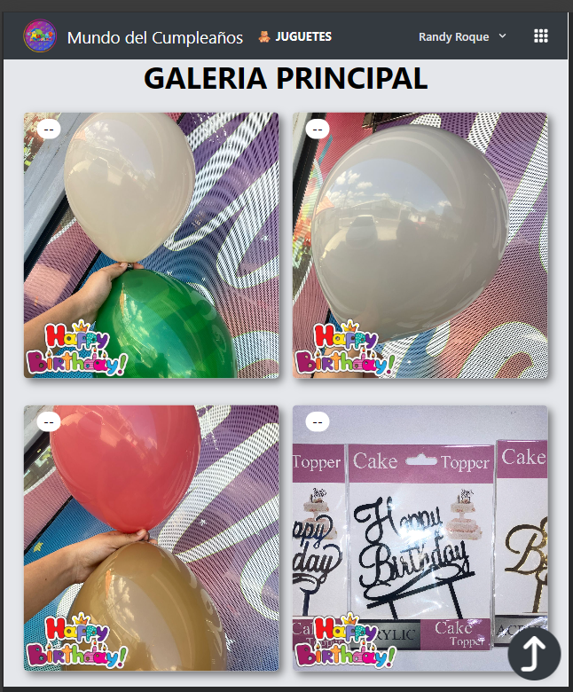

# 📸 Galeria_Laravel: Plataforma de Galería Fotográfica y Pedidos 

## Índice
- [Descripción del Proyecto](#descripción-del-proyecto)
- [Funcionalidades Principales](#funcionalidades-principales)
- [Tecnologías Utilizadas](#tecnologías-utilizadas)
- [Arquitectura del Sistema](#arquitectura-del-sistema)
- [Comandos por Entorno](#comandos-por-entorno)
- [Despliegue y CI/CD](#despliegue-y-cicd-automatizado)
- [Contribución](#contribución)
- [Autor](#autor)

## ✨ Descripción y Arquitectura

El proyecto `Galeria_Laravel` es una aplicación web moderna diseñada para la **visualización optimizada de catálogos fotográficos** y la gestión de **pedidos de artículos**. Utiliza una arquitectura monolítica híbrida impulsada por **Inertia.js**, lo que permite construir una *Single Page Application* (SPA) utilizando el enrutamiento y controladores clásicos de Laravel junto con la reactividad de React.

El sistema está optimizado para manejar grandes volúmenes de imágenes con un enfoque en la experiencia de usuario (UX), minimizando los tiempos de carga y facilitando la interacción comercial a través de WhatsApp.

> **Frontend (React + Inertia)**
Proporciona una experiencia de usuario fluida sin recargas de página completas. Gestiona el estado visual de la galería (columnas, filtros), el carrito de compras y la carga diferida (*Lazy Loading*) de imágenes.

> **Backend (Laravel)**
Actúa como el núcleo robusto del sistema, gestionando el sistema de archivos (*Filesystem*), la autenticación de administradores, la validación de datos y el procesamiento de eliminación masiva de recursos.

> **Base de Datos (MySQL)**
Almacena la información de los productos, usuarios administradores y registros de pedidos para un control eficiente del inventario y ventas.

## 📸 Capturas de Pantalla

| Galería Principal (Grid) | Detalle de Producto (Modal) |
| :---: | :---: |
|  |  | 

| Carrito de Pedidos | Vista Móvil |
| :---: | :---: |
|  | | 
---

## 🎯 Funcionalidades Clave

### 1. Experiencia Visual y Rendimiento
* **Lazy Loading Inteligente:** Implementación de componentes de carga diferida (`LazyLoadedImage`) para asegurar que el navegador solo descargue las imágenes visibles en el *viewport*, mejorando drásticamente el rendimiento inicial.
* **Layout Adaptable:** El usuario puede alternar dinámicamente la visualización de la grilla (1, 2 o 3 columnas) según su preferencia, persistiendo la configuración en el navegador.
* **Categorización Dinámica:** Navegación instantánea entre categorías principales (ej. "Galería Principal" vs "Juguetes") sin latencia.

### 2. E-Commerce y Pedidos
* **Carrito de Compras Persistente:** Gestión del estado del carrito mediante `localStorage`, permitiendo a los usuarios navegar libremente sin perder sus selecciones.
* **Integración con WhatsApp:** Sistema de "Checkout" que genera un resumen detallado del pedido y redirige automáticamente al cliente a WhatsApp para finalizar la compra directamente con el vendedor.
* **Modales Interactivos:** Uso de ventanas modales para ver detalles de productos, confirmar acciones y gestionar el carrito sin salir de la galería.

### 3. Administración y Gestión
* **Gestión de Archivos (Storage):** Carga y eliminación segura de imágenes utilizando el sistema de almacenamiento de Laravel (`storage/app/public`).
* **Eliminación Masiva:** Herramienta administrativa que permite seleccionar múltiples imágenes visualmente y eliminarlas en lote con una sola petición al servidor.
* **Seguridad:** Rutas protegidas mediante *Middleware* de autenticación de Laravel para asegurar que solo los administradores puedan modificar el catálogo.

---

## ⚙️ Tecnologías Utilizadas

###  Frontend

- **
   React**
  - Librería principal para la interfaz de usuario reactiva.

- **
   Inertia.js**
  - El "pegamento" que conecta Laravel y React, permitiendo construir una SPA sin una API compleja.

- **
   Tailwind CSS**
  - Framework de utilidades para un diseño rápido, responsivo y moderno.

- **
   Headless UI**
  - Componentes accesibles y sin estilos (Modales, Dialogs) integrados con Tailwind.

---

###  Backend

- **
   Laravel**
  - Framework PHP robusto para la lógica del servidor, enrutamiento y seguridad.

- **
   PHP**
  - Lenguaje base del servidor.

- **
   Illuminate/Filesystem**
  - Gestión avanzada de discos y almacenamiento de imágenes.

---
###  Base de Datos

- **
    MySQL**
  - Almacenamiento relacional para usuarios y metadatos de pedidos.

---

###  Herramientas y DevOps

- **
  Vite**
  - Empaquetador de módulos de próxima generación para un desarrollo frontend ultrarrápido.

- **
  GitHub Actions**
  - Automatización de CI/CD para despliegues.

- **
  VS Code**
  - Entorno de desarrollo con extensiones para PHP y React.

---

## 🚀 Despliegue y CI/CD Automatizado

El proyecto cuenta con integración para despliegue automatizado, ideal para entornos de hosting compartido o VPS.

### Configuración del Workflow
El archivo `.github/workflows/main.yml` gestiona el proceso de construcción y despliegue:

1.  **Build Frontend:** Instala dependencias NPM y ejecuta `npm run build` para generar los *assets* estáticos optimizados.
2.  **Prepare Backend:** Instala dependencias de Composer optimizadas para producción (`--no-dev`).
3.  **FTP Deploy:** Sincroniza los archivos resultantes con el servidor remoto utilizando credenciales seguras.

| Secret Name | Descripción |
| :--- | :--- |
| `FTP_SERVER` | Dirección del host FTP. |
| `FTP_USERNAME` | Usuario FTP. |
| `FTP_PASSWORD` | Contraseña FTP. |

---

## 📝 Comandos por Entorno

### **Backend (Laravel)**

| **Comando** | **Descripción** |
|-----------------------|-------------------------------------------------|
| `php artisan serve`   | Inicia el servidor de desarrollo local. |
| `php artisan migrate` | Ejecuta las migraciones de base de datos. |
| `php artisan optimize:clear` | Limpia caché de configuración, rutas y vistas. |

### **Frontend (React + Vite)**

| **Comando** | **Descripción** |
|-----------------|----------------------------------------------------|
| `npm run dev`   | Inicia el servidor de desarrollo con *Hot Module Replacement* (HMR). |
| `npm run build` | Compila y minifica los assets para producción en la carpeta `public/build`. |

---

## 🤝 Contribución

¡Tu ayuda es bienvenida para mejorar esta galería!

1.  Haz un fork del repositorio.
2.  Crea una rama (`git checkout -b feature/nueva-mejora`).
3.  Haz tus cambios y commit (`git commit -m 'Mejora: Agregado filtro por precio'`).
4.  Haz push a la rama (`git push origin feature/nueva-mejora`).
5.  Abre un Pull Request.

---

<h2 style="font-size: 1.5rem; font-weight: 600; border-bottom: 2px solid #3182ce">🧑‍💻 Autor</h2>
 <table >
                <tbody id="simbolo">
                <tr><td style="display: flex;">

</td><td> 
                

Ing. Benjamin Tavarez
         

Este proyecto fue desarrollado por <a href="https://github.com/SirBeho" style="color: #3182ce; text-decoration: underline;">Benjamin Tavarez</a> con el objetivo de ofrecer una solución robusta y visualmente atractiva para la gestión de catálogos y pedidos simplificados. Todos los derechos reservados.

Si tienes alguna pregunta, propuesta o comentario sobre este proyecto, no dudes en ponerte en contacto conmigo a través de <a href="mailto:benjamin.tavarez.98@gmail.com" style="color: #3182ce; text-decoration: underline;">benjamin.tavarez.98@gmail.com</a> o en <a href="https://www.linkedin.com/in/benjamin-tavarez-cruceta-052aa623b/" style="color: #3182ce; text-decoration: underline;">LinkedIn</a>.

</td>         
  </tr>
  </tbody>
</table>