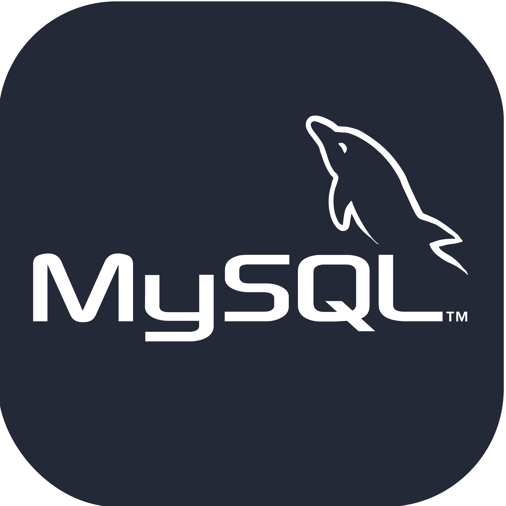
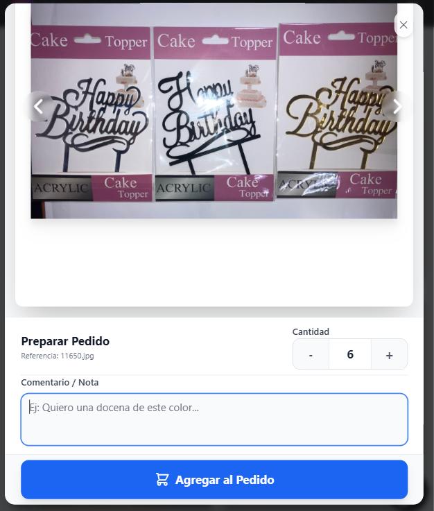
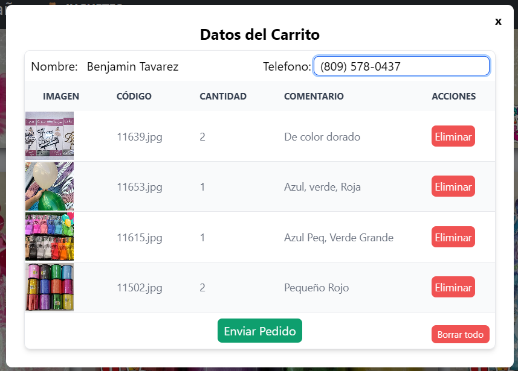
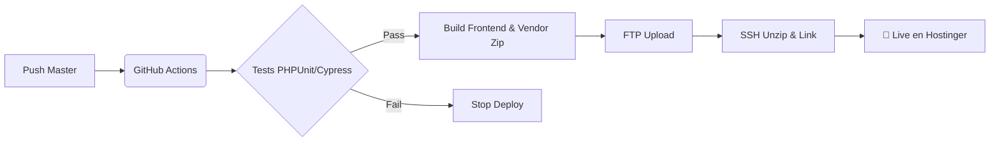

# 📸 Galeria_Laravel: Plataforma de Galería Fotográfica y Pedidos

[](https://github.com/SirBeho/Galeria_Laravel/actions/workflows/deploy.yml)
 

<p align="left">
  <a href="https://skillicons.dev"></a>&nbsp;<a>&nbsp;</a>&nbsp;<a></a>&nbsp;<a></a>
</p>

## Índice

-   [✨ Descripción General](#-descripción-y-arquitectura)
-   [🏛️ Arquitectura y Patrones](#️-arquitectura-y-patrones-de-diseño)
-   [📸 Capturas de Pantalla](#-capturas-de-pantalla)
-   [🎯 Funcionalidades Clave](#-funcionalidades-clave)
-   [⚙️ Tecnologías Utilizadas](#️-tecnologías-utilizadas)
-   [💻 Instalación y Configuración](#-instalación-y-configuración-local)
-   [🧪 Testing y QA (Cypress/PHPUnit)](#-testing-y-aseguramiento-de-calidad-qa)
-   [🚀 Despliegue y CI/CD](#-despliegue-y-cicd-automatizado)
-   [📝 Comandos Útiles](#-comandos-por-entorno)
-   [🤝 Contribución](#-contribución)
-   [📄 Licencia y Autor](#-licencia)

## ✨ Descripción y Arquitectura

El proyecto `Galeria_Laravel` es una aplicación web moderna diseñada para la **visualización optimizada de catálogos fotográficos** y la gestión de **pedidos de artículos**. Utiliza una arquitectura monolítica híbrida impulsada por **Inertia.js**, lo que permite construir una _Single Page Application_ (SPA) utilizando el enrutamiento y controladores clásicos de Laravel junto con la reactividad de React.

El sistema está optimizado para manejar grandes volúmenes de imágenes con un enfoque en la experiencia de usuario (UX), minimizando los tiempos de carga y facilitando la interacción comercial a través de WhatsApp.

> **Frontend (React + Inertia)**
> Proporciona una experiencia de usuario fluida sin recargas de página completas. Gestiona el estado visual de la galería (columnas, filtros), el carrito de compras y la carga diferida (_Lazy Loading_) de imágenes.

> **Backend (Laravel)**
> Actúa como el núcleo robusto del sistema, gestionando el sistema de archivos (_Filesystem_), la autenticación de administradores, la validación de datos y el procesamiento de eliminación masiva de recursos.

> **Base de Datos (MySQL)**
> Almacena la información de los productos, usuarios administradores y registros de pedidos para un control eficiente del inventario y ventas.

## 📸 Capturas de Pantalla

|        Galería Principal        |       Detalle de Producto (Modal)        |
| :-----------------------------: | :--------------------------------------: |
|  |  |

|         Carrito de Pedidos         |               Vista Móvil                |
| :--------------------------------: | :--------------------------------------: |
|  |  |

---

## 🎯 Funcionalidades Clave

### 1. Experiencia Visual y Rendimiento

-   **Lazy Loading & Caché:** Implementación de componentes de carga diferida (`LazyLoadedImage`) para descagar solo las imágenes visibles en el _viewport_.Incluye persistencia en el navegador para asegurar visitas recurrentes instantáneas.
-   **Layout Adaptable:** El usuario puede alternar dinámicamente la visualización (1, 2 o 3 columnas) según su preferencia, persistiendo la configuración en el navegador para futuras sesiones.
-   **Scroll Infinito y Categorización(SPA):** Navegación instantánea entre categorías (ej. "Galería Principal" vs "Juguetes") sin latencia y flujo de scroll dinámico que acumula imágenes sin recargar la página.
-   **Optimización WebP & Thumbs:** Conversión automática de imágenes a (`WebP`) y generación de thumbnails (400px), reduciendo el peso de los archivos hasta un 60% para una carga ultra-ligera.

### 2. E-Commerce y Pedidos

-   **Carrito de Compras Persistente:** Gestión del estado del carrito mediante `localStorage`, permitiendo a los usuarios navegar libremente sin perder sus selecciones.
-   **Integración con WhatsApp:** Sistema de "Checkout" que genera un resumen detallado del pedido y redirige automáticamente al cliente a WhatsApp para finalizar la compra directamente con el vendedor.
-   **Modales Interactivos:** Uso de ventanas modales para ver detalles de productos, confirmar acciones y gestionar el carrito sin salir de la galería.
-   **Enlaces de Seguimiento Seguro:** Generación de URLs únicas protegidas por tokens de seguridad (key), permitiendo a los clientes consultar el detalle de su pedido sin necesidad de crear una cuenta de usuario.
-   **Notificaciones Tiempo Real:** Generacion de notificacion al navegador del admin mediante el protocolo WebPush al generarse un pedido, permitiendo ver detalles del pedido incluso con el navegador cerrado.

### 3. Administración y Gestión

-   **Gestión de Archivos (Storage):** Carga y eliminación segura de imágenes utilizando el sistema de almacenamiento de Laravel (`storage/app/public`).
-   **Eliminación Masiva:** Herramienta administrativa que permite seleccionar múltiples imágenes visualmente y eliminarlas en lote con una sola petición al servidor.
-   **Seguridad:** Rutas protegidas mediante _Middleware_ de autenticación de Laravel para asegurar que solo los administradores puedan modificar el catálogo.

---

## ⚙️ Tecnologías Utilizadas

###   Frontend & UI

-   **  React 18**
    -   Librería principal para la construcción de interfaces reactivas y modulares.
-   **  Inertia.js**
    -   El puente monolítico que conecta Laravel y React, eliminando la necesidad de una API REST compleja.
-   **  Tailwind CSS**
    -   Framework de estilos "utility-first" para un diseño rápido y responsivo.
-   **  Headless UI & Flowbite**
    -   Componentes accesibles (Modales, Menús) integrados perfectamente con Tailwind.
-   **  Service Workers API**
    -   Gestión de eventos en segundo plano que permite recibir y mostrar notificaciones incluso cuando la aplicación no está abierta en el navegador.

---

###   Backend & Servicios </span>

-   **  Laravel 10**
    -   Framework PHP robusto para la lógica del servidor, enrutamiento y seguridad.
-   **  PHP 8.2**
    -   Lenguaje base del servidor.
-   **  Illuminate/Filesystem**
    -   Gestión avanzada de discos y almacenamiento de imágenes.
-   **  Intervention Image**
    -   Motor de procesamiento para la manipulación y optimización de recursos gráficos.
-   **  Web-Push**
    -   Gestión de notificaciones cifradas desde el servidor Laravel.

---

###   Base de Datos</span>

-   **  MySQL**
    -   Almacenamiento relacional para usuarios y metadatos de pedidos.

---

###   Herramientas y DevOps</span>

-   **  GitHub**
    -   Plataforma de alojamiento de código y control de versiones mediante Git.
-   **  GitHub Actions**
    -   Pipeline de CI/CD para despliegues.
-   **  VS Code**
    -   Entorno de desarrollo con extensiones para PHP y React.
-   **  Cypress**
    -   Testing End-to-End (E2E) para automatización de navegadores y pruebas de integración.
-   **  PHPUnit**
    -   Framework de pruebas unitarias y de características para la lógica del backend.
-   **  Vite**
    -   Empaquetador de módulos de próxima generación para un desarrollo frontend ultrarrápido.
-   **  Linux (Hostinger)**
    -   Entorno de producción.

---

## 💻 Instalación y Configuración Local

Sigue estos pasos para levantar el proyecto en tu entorno de desarrollo:

### Pre-requisitos

-   **PHP:** 8.2 o superior.
-   **Composer:** Gestor de dependencias de PHP.
-   **Node.js & NPM:** (Recomendado v18+).
-   **MySQL:** Base de datos.

### Pasos de Instalación

1.  **Clonar el repositorio:**

    ```bash
    git clone [https://github.com/SirBeho/Galeria_Laravel.git](https://github.com/SirBeho/Galeria_Laravel.git)
    cd Galeria_Laravel
    ```

2.  **Instalar dependencias:**

    ```bash
    # Backend (Laravel)
    composer install

    # Frontend (React/Inertia)
    npm install
    ```

3.  **Configurar variables de entorno:**

    ```bash
    cp .env.example .env
    ```

    _Abre el archivo `.env` y configura tus credenciales de base de datos (`DB_DATABASE`, `DB_USERNAME`, etc.)._

4.  **Generar clave de aplicación:**

    ```bash
    php artisan key:generate
    ```

5.  **Vincular el Storage (Vital para las imágenes):**

    ```bash
    php artisan storage:link
    ```

6.  **Ejecutar migraciones y seeders (si aplica):**

    ```bash
    php artisan migrate
    ```

7.  **Ejecutar servidores de desarrollo:**
    -   Terminal 1 (Backend): `php artisan serve`
    -   Terminal 2 (Frontend): `npm run dev`

```bash
Galeria_Laravel/
├── app/
│   ├── Http/Controllers/  # Lógica de Backend (API & Vistas)
│   └── Models/            # Modelos Eloquent (Producto, Pedido)
├── database/              # Migraciones y Seeders
├── public/
│   └── build/             # Assets compilados por Vite (No tocar)
├── resources/
│   ├── css/               # Tailwind directives
│   ├── js/
│   │   ├── Components/    # Átomos y Moléculas (Botones, Inputs)
│   │   ├── Layouts/       # Plantillas persistentes (Navbar, Footer)
│   │   ├── Pages/         # Vistas de Inertia (Home, Cart, Admin)
│   │   └── app.jsx        # Punto de entrada de React
│   └── views/
│       └── app.blade.php  # Root template de Laravel
├── routes/
│   └── web.php            # Rutas de Laravel (apuntan a controladores Inertia)
├── tests/
│   ├── Feature/           # PHPUnit Tests
│   └── cypress/           # E2E Tests
└── vite.config.js         # Configuración del compilador
```

---

## 🧪 Testing y Aseguramiento de Calidad (QA)

El proyecto cuenta con una estrategia de testing híbrida que asegura tanto la lógica de negocio en el servidor como la experiencia del usuario final en el navegador.

### 1. Backend Testing (PHPUnit)

Se utiliza **PHPUnit** configurado con un entorno aislado (`.env.testing`) y una base de datos SQLite persistente en archivo (`database/testing.sqlite`). Esto garantiza consistencia de datos y permite depurar el estado de la base de datos post-test si es necesario.

| Suite de Pruebas                | Cobertura Principal                                                                                                                                         |
| :------------------------------ | :---------------------------------------------------------------------------------------------------------------------------------------------------------- |
| **📸 Carga de Imágenes**        | • Validación de tipos MIME y tamaños.<br>• Simulación de sistema de archivos (`Storage::fake`).<br>• Renombrado secuencial de archivos (52.jpg, 53.jpg...). |
| **🗑️ Gestión de Archivos**      | • Eliminación segura de imágenes.<br>• Manejo de errores ante archivos inexistentes.<br>• Protección de rutas administrativas.                              |
| **📦 Procesamiento de Pedidos** | • Validación estricta de payloads JSON.<br>• Generación correcta de enlaces de **WhatsApp**.<br>• Integración y consistencia en Base de Datos.              |
| **🔒 Seguridad de Vistas**      | • Acceso denegado a pedidos con claves (keys) inválidas.<br>• Redirección de usuarios no autenticados.                                                      |

### 2. End-to-End Testing (Cypress)

Se utiliza **Cypress** ejecutándose contra un servidor de pruebas dedicado (`php artisan serve --env=testing`). Este entorno comparte la misma base de datos SQLite de pruebas, asegurando un aislamiento total de los datos de desarrollo/producción y garantizando la persistencia necesaria para flujos complejos.

| Suite / Flujo                  | Escenarios Críticos Validados                                                                                                                                                                                                             |
| :----------------------------- | :---------------------------------------------------------------------------------------------------------------------------------------------------------------------------------------------------------------------------------------- |
| **🛒 Flujo Crítico de Compra** | • Ciclo completo: `Galería` -> `Carrito` -> `Checkout` -> `WhatsApp`.<br>• Validación de ventanas modales y alertas nativas (`window.alert`, `window.open`).<br>• Bloqueo de envío de formulario si el carrito se vacía intencionalmente. |
| **💾 Persistencia & UX**       | • **Resiliencia:** Verificación de que los ítems del carrito sobreviven a una recarga de página (`F5`) .<br>• **Preferencias:** Persistencia de la configuración visual (Grid de 1 vs 3 columnas) tras recargar el navegador.             |
| **🛡️ Panel Administrativo**    | • **Gestión de Estado:** Cambio de estatus de pedido (Pendiente -> Completado) vía AJAX/Inertia sin recarga completa.<br>• **Visualización:** Renderizado correcto de tablas de datos y coincidencia de detalles de pedido.               |
| **🔑 Autenticación**           | • Protección de rutas `/panel` y `/subir` contra accesos directos.<br>• Flujo de Login exitoso y manejo de errores de credenciales.                                                                                                       |

## 🚀 Despliegue y CI/CD Automatizado

El proyecto utiliza **GitHub Actions** para orquestar un pipeline de integración y despliegue continuo. Este flujo de trabajo asegura que el código sea probado, optimizado y desplegado de forma atómica.

### Workflow del Pipeline (`deploy.yml`)

Cada vez que se realiza un `push` a la rama `master`, se activan secuencialmente las siguientes etapas:

| Etapa                             | Descripción                                                                                                                                                                                                                                                        |
| :-------------------------------- | :----------------------------------------------------------------------------------------------------------------------------------------------------------------------------------------------------------------------------------------------------------------- |
| **1. Setup & Caching**            | Configuración de PHP 8.2 y restauración inteligente del caché de `vendor` para acelerar la instalación de dependencias.                                                                                                                                            |
| **2. Backend Build**              | Instalación de dependencias de Composer optimizadas (`--no-dev`) y generación del archivo `.env` de producción. **Empaquetado de `vendor.zip`** para reducir drásticamente el tiempo de transferencia FTP.                                                         |
| **3. Quality Gate (PHPUnit)**     | Ejecución de la suite de pruebas **PHPUnit** (Backend). Valida la lógica, integridad de la base de datos y el sistema de archivos (Storage Mocks).                                                                                                                 |
| **4. Quality Gate (Cypress E2E)** | **Ejecución de las pruebas End-to-End de Cypress**. Asegura que la capa de React/Inertia funcione correctamente y que el flujo de compra crítica (carrito, formulario) sea exitoso.                                                                                |
| **5. Frontend Build**             | Instalación de dependencias NPM y compilación de assets con Vite (`npm run build`). Limpieza del workspace para eliminar archivos innecesarios (`node_modules`, `tests`).                                                                                          |
| **6. FTP Deployment**             | Sincronización inteligente de archivos con el servidor de destino utilizando las credenciales seguras de FTP: **Backend** (Core de Laravel y `vendor.zip`) y **Frontend** (Assets públicos) para asegurar que la estructura de carpetas en Hostinger sea correcta. |
| **7. SSH Post-Deploy**            | Conexión segura al servidor para tareas finales: <br>• Descompresión ultra-rápida de `vendor.zip`.<br>• Creación de enlaces simbólicos (`storage:link`).<br>• Limpieza profunda de caché (`artisan optimize`).                                                     |

---



---

### Configuración de Secretos

Para replicar este entorno, es necesario configurar los siguientes **GitHub Secrets** en el repositorio:

| Variable Secreta            | Propósito                                                                  |
| :-------------------------- | :------------------------------------------------------------------------- |
| `FTP_HOST` / `SSH_HOST`     | Dirección IP o dominio del servidor (Hostinger).                           |
| `FTP_USERNAME` / `SSH_USER` | Usuario del hosting con acceso SSH y FTP.                                  |
| `FTP_PASSWORD`              | Contraseña de acceso FTP.                                                  |
| `PRIVATE_KEY_SSH`           | Clave privada SSH (Ed25519) para ejecutar comandos remotos sin contraseña. |
| `ENV_FILE`                  | Contenido completo del archivo `.env` de producción.                       |
| `DEPLOY_CLEAN_TOKEN`        | Token de seguridad para validaciones internas de despliegue.               |

> **Nota:** El despliegue utiliza una estrategia de **"Vendor Zipping"**: en lugar de subir miles de archivos pequeños de la carpeta `vendor` por FTP (que es lento), se sube un único archivo `.zip` y se descomprime en el servidor vía SSH, reduciendo el tiempo de despliegue de minutos a segundos. Tambien excluye automáticamente archivos innecesarios como `.git`, `node_modules` (de desarrollo) y archivos de configuración de tests para mantener el servidor limpio.

---

## 📝 Comandos por Entorno

### **Backend (Laravel)**

| **Comando**                  | **Descripción**                                |
| ---------------------------- | ---------------------------------------------- |
| `php artisan serve`          | Inicia el servidor de desarrollo local.        |
| `php artisan migrate`        | Ejecuta las migraciones de base de datos.      |
| `php artisan optimize:clear` | Limpia caché de configuración, rutas y vistas. |

### **Frontend (React + Vite)**

| **Comando**     | **Descripción**                                                             |
| --------------- | --------------------------------------------------------------------------- |
| `npm run dev`   | Inicia el servidor de desarrollo con _Hot Module Replacement_ (HMR).        |
| `npm run build` | Compila y minifica los assets para producción en la carpeta `public/build`. |

### **Testing (Cypress + PHPUnit)**

| **Comando**        | **Descripción**                                                               |
| ------------------ | ----------------------------------------------------------------------------- |
| `php artisan test` | Ejecuta la suite de pruebas unitarias y de características (PHPUnit).         |
| `npm run test `    | Ejecuta el flujo completo de Cypress (Migración + Servidor Test + Tests E2E). |
| `npx cypress open` | Abre la interfaz interactiva de Cypress (Requiere servidor corriendo).        |

---

## 🤝 Contribución

¡Tu ayuda es bienvenida para mejorar esta galería!

1.  Haz un fork del repositorio.
2.  Crea una rama (`git checkout -b feature/nueva-mejora`).
3.  Haz tus cambios y commit (`git commit -m 'Mejora: Agregado filtro por precio'`).
4.  Haz push a la rama (`git push origin feature/nueva-mejora`).
5.  Abre un Pull Request.

---

## 📄 Licencia

Este proyecto es de código abierto y está disponible bajo la **[Licencia MIT](https://opensource.org/licenses/MIT)**.

<h2 style="font-size: 1.5rem; font-weight: 600; border-bottom: 2px solid #3182ce">🧑‍💻 Autor</h2>
 <table >
                <tbody id="simbolo">
                <tr><td style="display: flex;"><div style="width: 10rem; height: 13rem; border-radius: 0.5rem; overflow: hidden; box-shadow: 0 4px 6px -1px rgba(0, 0, 0, 0.1);" ></div></td><td> 
                
<p style="display: block; font-size: 2rem; font-weight: 700;">Ing. Benjamin Tavarez</p>

<p style="margin-top: 0.5rem; font-size: 1rem;">Este proyecto fue desarrollado por <a href="https://github.com/SirBeho" style="color: #3182ce; text-decoration: underline;">Benjamin Tavarez</a> con el objetivo de ofrecer una solución robusta y visualmente atractiva para la gestión de catálogos y pedidos simplificados. Todos los derechos reservados.</p>

<p style="margin-top: 0.25rem; font-size: 0.875rem;">Si tienes alguna pregunta o comentario sobre este proyecto, no dudes en ponerte en contacto conmigo a través de <a href="mailto:benjamin.tavarez.98@gmail.com" style="color: #3182ce; text-decoration: underline;">benjamin.tavarez.98@gmail.com</a> o en <a href="https://www.linkedin.com/in/benjamin-tavarez-cruceta-052aa623b/" style="color: #3182ce; text-decoration: underline;">LinkedIn</a>.</p>
</td>         
  </tr>
  </tbody>
</table>
